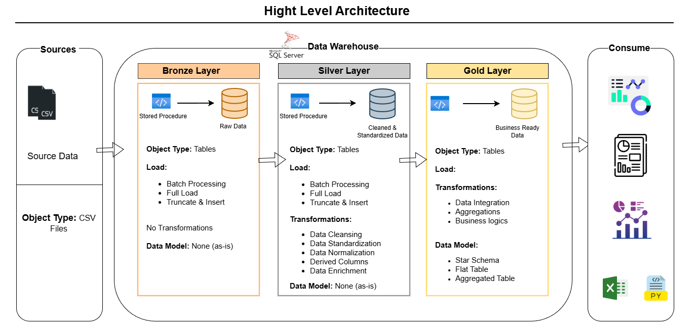

# DataCo Supply Chain Analytics – SQL Server Data Warehouse & Power BI

## 📦 Overview  
This project focuses on building a complete **SQL Server Data Warehouse (Bronze → Silver → Gold)** and developing **Power BI dashboards** to analyze and improve DataCo Global’s supply chain performance.  
The dataset contains 180,000+ orders (2015–2018) including delivery status, shipping cost, customer location, product categories, and profit metrics.

The outcome of this project is a fully modeled warehouse plus interactive BI dashboards that support strategic supply chain decisions.

The DataCo Global dataset represents a simulated end‑to‑end e‑commerce supply chain environment designed for analytics, data warehousing, and business intelligence experimentation. It captures real‑world operational processes across procurement, order handling, shipping, delivery performance, customer behavior, regional logistics, and product categorization. The dataset contains structured transactional data generated from the company’s provisioning, production, sales, and distribution workflows, making it ideal for understanding how orders move through a complete supply chain lifecycle.
Three major product lines are included—Clothing, Sporting Goods, and Electronics—allowing analysis of category‑specific performance and profitability.

- 180k+ order records (2015–2018)  
- 50+ features (orders, customers, products, delivery, costs)  
- 30k+ unique customers  
- 10k+ products  
- Includes: Order Date, Shipping Date, Delivery Risk, Region, Department, Profit, Shipping Cost, Customer Attributes
- https://www.kaggle.com/datasets/shashwatwork/dataco-smart-supply-chain-for-big-data-analysis/data

---

## Business Goals

### 1. Build a Full SQL Server Data Warehouse  
- **Saleem:** Bronze layer ingestion & initialization  
- **Abdelrahman:** Silver & Gold layers with star schema and business rules  

### 2. Improve Delivery Performance  
- **Mostafa:** Delivery KPIs, DAX measures  
- **Sameer:** Interactive delivery dashboards  

### 3. Optimize Shipping & Operational Costs  
- **Abdelrahman:** Cost fact tables in Gold layer  
- **Mostafa & Sameer:** Cost KPIs and dashboards  

### 4. Enhance Product, Regional, and Customer Insights  
- **Saleem:** Ensure raw data integrity in Bronze  
- **Abdelrahman:** Build cleaned dimensions in Silver/Gold  
- **Power BI team:** Drill‑downs for region, product, customers  

### 5. Executive BI Reporting  
- Final Power BI dashboards  
- Insights for leadership  
- Reliable metrics from Gold layer

---

# 📅 Project Plan (8 Weeks)

**Click below to view the interactive project plan:**  

---

## Data Files

- `DataCoSupplyChainDataset.csv` – Main dataset  
- `DescriptionDataCoSupplyChain.csv` – Metadata dictionary  
- `tokenized_access_logs.csv` – Optional access logs  

> **Note:** Data files are not included in the repository due to size limitations.

---

# 👥 Team Structure

| Role | Responsibility | Team Member |
|------|----------------|-------------|
| **SQL Data Engineer (Bronze Layer)** | Data ingestion, raw layer setup, initialization | **Saleem Khaled** |
| **SQL Data Warehouse Developer (Silver & Gold)** | Cleansing, business rules, star schema | **Abdelrahman Mohamed** |
| **Power BI Analyst** | KPI definition, DAX formulas, business insights | **Mohamed Mostafa** |
| **Power BI Developer** | Dashboard design, modeling, interactions | **Mohamed Sameer** |

---

# 📦 Data Warehouse Architecture

The project uses a Medallion Architecture implemented fully inside **SQL Server**.

### **1. Bronze Layer – Raw Data**
- Owner: **Saleem**  
- CSV → SQL ingestion  
- Initial structure  
- Basic type corrections and checks  

### **2. Silver Layer – Cleaned & Standardized**
- Owner: **Abdelrahman**  
- Clean, dedupe, standardize  
- Date formatting  
- Normalized relationships  

### **3. Gold Layer – Business-Ready Star Schema**
- Owner: **Abdelrahman**  
- Fact tables for Orders, Shipping, Delivery, Financials  
- Dimension tables for Customer, Region, Product, Department, Date  
- Final tables consumed by Power BI  

---

# 🚀 Final Deliverables

1. SQL Server Data Warehouse (Bronze → Silver → Gold)  
2. Power BI data model (.pbix)  
3. Interactive dashboards (delivery, cost, regional, product, customer)  
4. KPI dictionary with DAX  
5. ETL documentation  
6. Star schema / ERD  
7. Executive insights & recommendations  

---

# 📚 Documentation (in `/Docs`)

- Data Dictionary  
- Bronze / Silver / Gold ETL Logic  
- Star Schema Diagram  
- SQL Transformation Guide  
- ERDs & table mappings  

---

# 👤 Project Lead – SQL Engineering

**Saleem Khaled**  
SQL Server Data Engineer | Data Warehousing Specialist  

- LinkedIn: https://www.linkedin.com/in/saleem-khaled-a502b3253/  
- GitHub: https://github.com/Selim9-9  

---

# 📧 Contact

- Open a GitHub Issue for technical questions  
- Contact **Saleem** for warehouse inquiries  
- View the Project Plan on Notion:  
  https://garrulous-cake-5cd.notion.site/Supply-Chain-Analysis-Project-Plan-eaf8285b7a0c4c9ab311f08658e064c3
